<h1 align="center">docs-studio</h1>

<p align="center"><strong>A Claude Code skill that gives any project living documentation: diagrams that animate, pages that scan your repo on every commit, a status board and a whiteboard. Call it once.</strong></p>

<p align="center">
  <picture>
    <source media="(prefers-color-scheme: dark)" srcset="images/gallery-dark.png">
    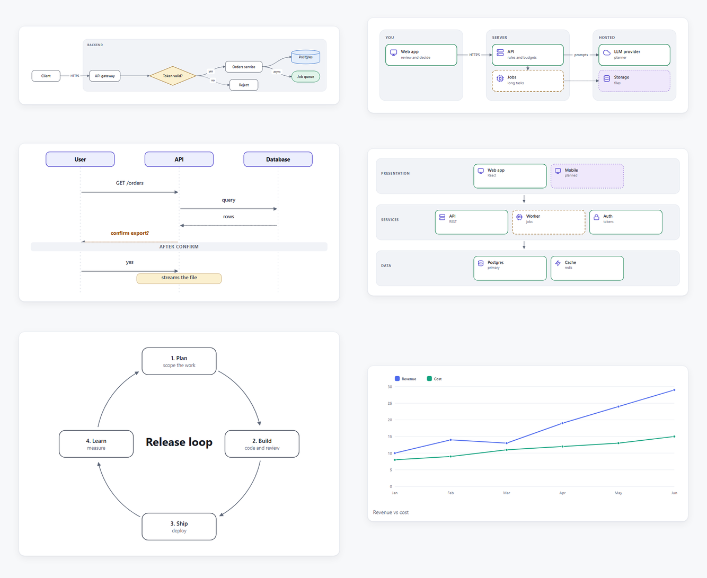
  </picture>
</p>

<p align="center">
  
  
  
  
</p>

---

## The problem

Project docs rot. The architecture diagram was right in March. The README describes a folder that no longer exists. Nobody wants to redraw boxes in a drawing tool, and the people (and agents) who join later pay for it.

## The idea

Let the agent that already reads your code **write the docs**, and let the repository **keep the numbers honest**:

- **Claude writes the pages.** It reads your README, manifests and entry points, then writes Markdown pages with diagrams. It asks you when the repo can't answer something.
- **The repo writes the rest.** On every build, scanners derive the folder map, import graph, language stats, git activity, dependencies and TODOs straight from the code, so they cannot drift.
- **Hooks keep it alive.** A git `post-commit` hook rebuilds the docs after every commit. A SessionStart hook starts the server in every Claude Code session and tells Claude when the written pages lag behind the code.

You call the skill **once per project**. Everything else is automatic.

## See it

### 20+ diagram presets, a few lines of text each

Describe a diagram in plain text; the layout is automatic. Light and dark themes, PNG/SVG export and a full-screen pan/zoom viewer come free.

<table>
<tr>
<td width="50%">

```
:::flow lr
client[Client] -> gw[API gateway]: HTTPS
gw -> auth{Token valid?}
auth -> svc[Orders service]: yes
auth --> deny[Reject]: no
svc -> db[(Postgres)]
svc -> q[[Job queue]]: async
group Backend: gw, auth, svc, q, db
:::
```

</td>
<td width="50%">
<picture>
  <source media="(prefers-color-scheme: dark)" srcset="images/presets/flow-dark.png">
  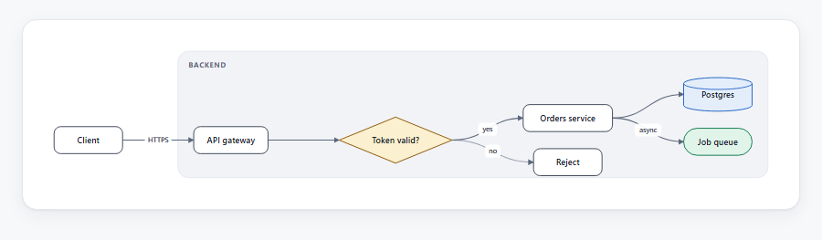
</picture>
</td>
</tr>
<tr>
<td width="50%">

```
:::zones cols=3
## You
- web | monitor | Web app | review and decide | done
## Server
- api | server | API | rules and budgets | done
- jobs | cpu | Jobs | long tasks | running
## Hosted
- llm | cloud | LLM provider | planner | done
web -> api: HTTPS
api -> jobs
api -> llm: prompts
:::
```

</td>
<td width="50%">
<picture>
  <source media="(prefers-color-scheme: dark)" srcset="images/presets/zones-dark.png">
  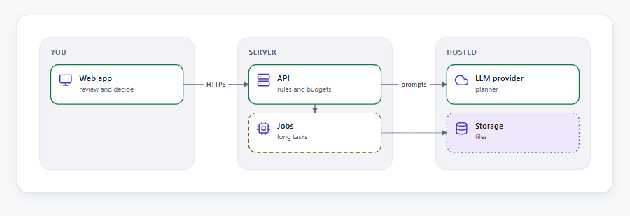
</picture>
</td>
</tr>
<tr>
<td width="50%">

```
:::sequence
User | API | Database
User -> API: GET /orders
API -> Database: query
Database --> API: rows
API --> User: ! confirm export?
== After confirm ==
User -> API: yes
note API: streams the file
:::
```

</td>
<td width="50%">
<picture>
  <source media="(prefers-color-scheme: dark)" srcset="images/presets/sequence-dark.png">
  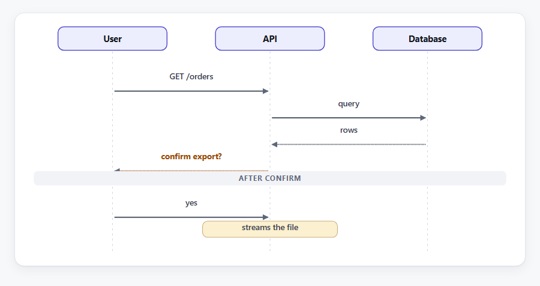
</picture>
</td>
</tr>
</table>

| | Presets |
|---|---|
| **Flows and behaviour** | `flow` · `swimlane` · `sequence` · `state` · `cycle` · `funnel` |
| **Structure** | `zones` (system map) · `layers` (architecture stack) · `tree` · `mindmap` · `er` (schema) · `network` · `pyramid` |
| **Data** | `chart` (line, area, column, stack) · `donut` · `radar` · `heatmap` · `gantt` · `quadrant` · `stats` (KPI tiles with sparklines) |
| **Blocks** | `cards` · `steps` · `timeline` · `bars` · `kanban` · `board` |

<details>
<summary><strong>More presets: swimlane, mind map, Gantt, KPI tiles</strong></summary>
<br>
<picture>
  <source media="(prefers-color-scheme: dark)" srcset="images/presets/swimlane-dark.png">
  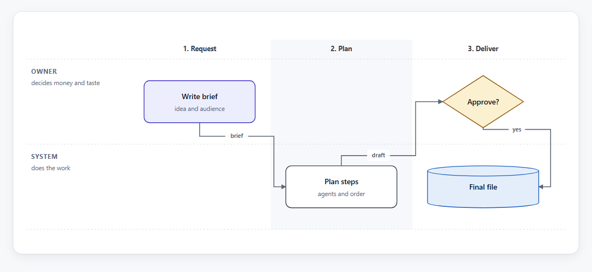
</picture>
<picture>
  <source media="(prefers-color-scheme: dark)" srcset="images/presets/gantt-dark.png">
  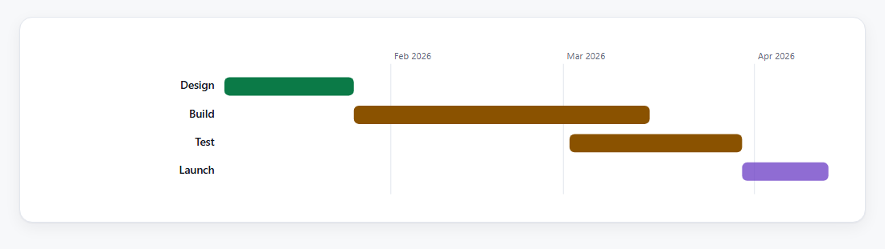
</picture>
<picture>
  <source media="(prefers-color-scheme: dark)" srcset="images/presets/mindmap-dark.png">
  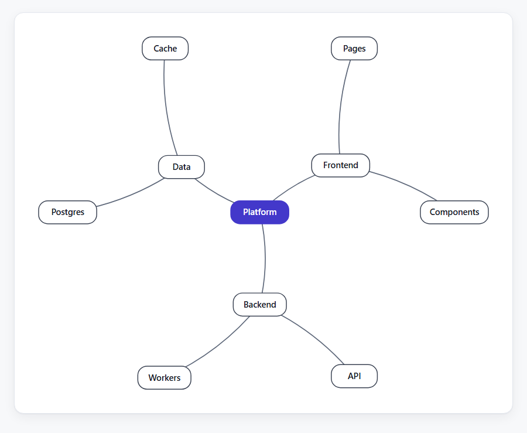
</picture>
<picture>
  <source media="(prefers-color-scheme: dark)" srcset="images/presets/stats-dark.png">
  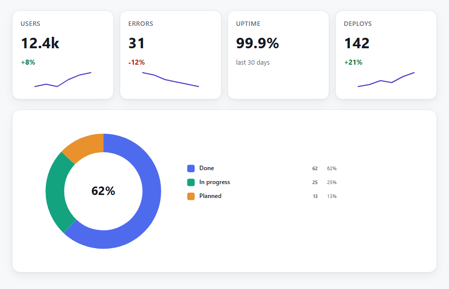
</picture>
</details>

### Animations that explain, not decorate

Add `anim=NAME` to any diagram. Every preset has a sensible default; `static` turns motion off.

| `anim=` | What moves |
|---|---|
| `packets` | dots travel along connections: data moving through a flow |
| `trace` | connections light up one by one, in order, on a loop: walk through a sequence |
| `flow` | dashes march along every line |
| `reveal` | elements fade in one after another when scrolled into view (with a Replay button) |
| `draw` | lines draw themselves, bars and slices grow |
| `pulse`, `glow` | nodes breathe in turn |

Visitors with *reduced motion* see still diagrams. PNG/SVG exports always show the finished picture.

### Pages scanned from your repo, on every commit

No prompt, no config: the **Auto** section is generated from the code each time the docs build.

<picture>
  <source media="(prefers-color-scheme: dark)" srcset="images/site-overview-dark.png">
  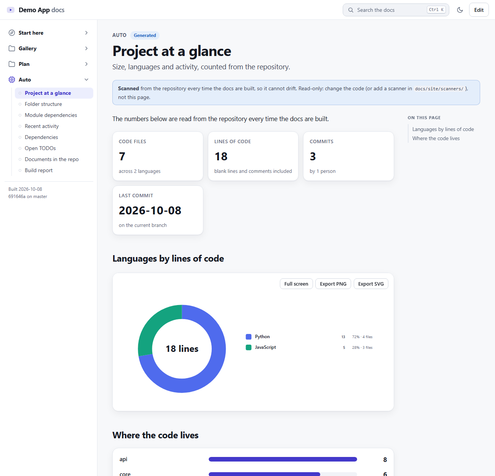
</picture>

Built in: project at a glance · folder structure · **module dependency graph** (Python, JS/TS imports) · git activity · dependencies (package.json, requirements, pyproject, go.mod, Cargo.toml, Gemfile, pubspec) · open TODOs · documents found in the repo. Add your own scanner as a 10-line Python file.

<picture>
  <source media="(prefers-color-scheme: dark)" srcset="images/site-modules-dark.png">
  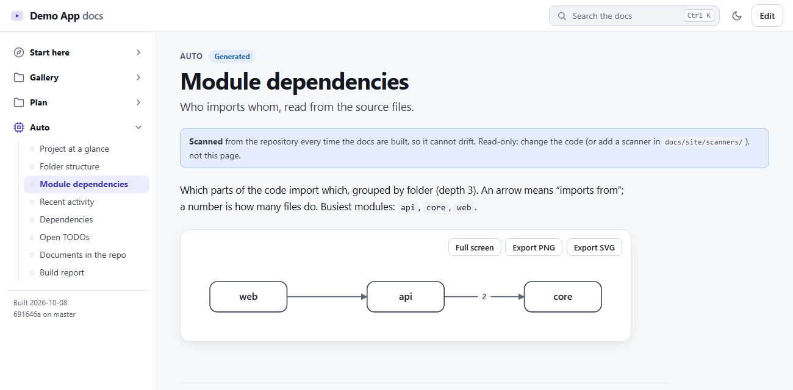
</picture>

### A status board and a whiteboard, saved in the repo

<table>
<tr>
<td width="50%">
<picture>
  <source media="(prefers-color-scheme: dark)" srcset="images/site-board-dark.png">
  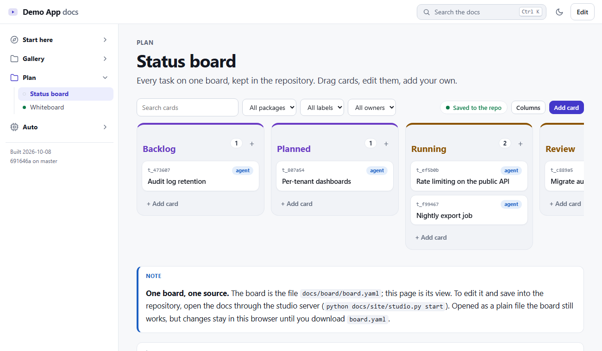
</picture>
</td>
<td width="50%">
<picture>
  <source media="(prefers-color-scheme: dark)" srcset="images/site-whiteboard-dark.png">
  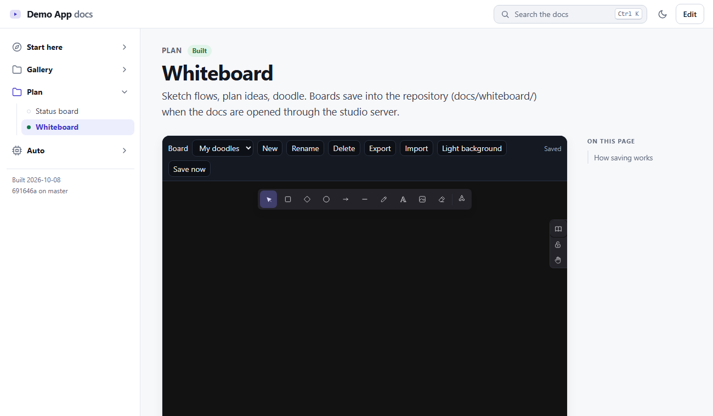
</picture>
</td>
</tr>
</table>

- **Board:** a kanban over `docs/board/board.yaml`. Drag cards, edit them in the browser, or let agents move their own cards from the command line (`python docs/board/board.py move <id> running`).
- **Whiteboard:** Excalidraw, vendored so it works offline. Boards are saved as files in `docs/whiteboard/`; import and export `.excalidraw`.

## How it works

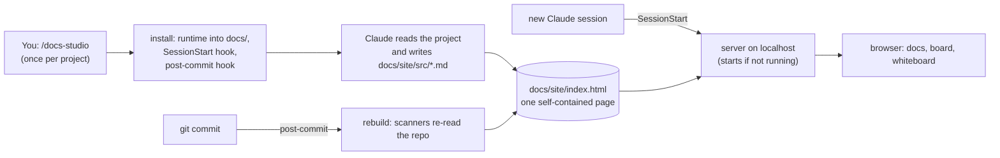

1. **Install** (`scripts/install.py`) copies a small runtime into `docs/`, writes `docs/studio.json`, registers the hooks, builds the site and starts the server. Re-running it updates the runtime and never touches your content.
2. **Claude writes** 3 to 12 pages from what it reads, choosing diagram presets by what each page needs to show, and checks every arrow against the code.
3. **Every commit** rebuilds the site in the background. The commit hook counts how many commits touched the code since the written pages were last reviewed.
4. **Every session** starts the server. When the pages lag behind, Claude is told and offers `refresh`: it reads only the changed areas and updates the pages they affect.

## Install

```bash
git clone <this repo> ~/.claude/skills/docs-studio     # or copy the folder there
```

On Windows: `%USERPROFILE%\.claude\skills\docs-studio`. Start a new Claude Code session, open a project and say:

> document this project with docs-studio

or type `/docs-studio`. That's the only time you have to ask.

**Requirements:** Claude Code, Python 3.9+ and PyYAML (`python -m pip install pyyaml`; the installer tries it for you). Git is optional (without it you lose the commit hook and the activity scanners). Nothing else: no Node, no build step, no network, no CDN.

## Everyday use

Ask Claude in plain language:

| You say | It does |
|---|---|
| "add a sequence diagram of the checkout flow" | picks the preset, writes it into the right page, builds, looks at it |
| "make the data flow animate" | adds `anim=packets` (or `trace`) |
| "refresh the docs" | reads what changed since the last review and updates the affected pages |
| "turn off the docs server" | `studio.py stop` |

Or use the CLI yourself (from the project root):

```bash
python docs/site/studio.py start | stop | status | url   # the server
python docs/site/studio.py build                           # rebuild now
python docs/site/studio.py presets                         # every preset with its syntax
python docs/site/studio.py changes                         # what changed since the pages were reviewed
python docs/site/studio.py hosting netlify                 # publish config (also vercel)
```

## What it adds to your project

```
docs/
  studio.json            settings: name, port, animation default, scan options
  site/
    src/*.md             the pages (written by Claude, edited by you)
    index.html           the built site (one file, opens straight from disk)
    presets_custom/      your own diagram presets   (optional)
    scanners/            your own scanners          (optional)
    ...                  builder, server, theme, presets (updated by re-running install)
  board/board.yaml       the status board
  whiteboard/            saved whiteboards
  .studio/               runtime state (gitignored)
.claude/settings.json    SessionStart hook
.githooks/post-commit    rebuild hook (or appended to your existing hooks)
```

Uninstall with `python ~/.claude/skills/docs-studio/scripts/install.py --project . --uninstall`; it removes both hooks and leaves `docs/` for you to keep or delete.

## Make it yours

**A project-specific diagram** (`docs/site/presets_custom/badges.py`):

```python
from presets.common import preset, svg_open, esc, items, fields

@preset("badges", anim="reveal", syntax="- Label | note")
def badges(ctx):
    rows = [fields(i, 2) for i in items(ctx.body)]
    parts = [f'<g class="pv-n" style="--i:{k}"><rect class="pv-shape" x="{20 + k * 150}" y="20" width="140" height="48" rx="10"/>'
             f'<text class="pv-t" x="{90 + k * 150}" y="50" text-anchor="middle">{esc(r[0])}</text></g>' for k, r in enumerate(rows)]
    return svg_open(40 + len(rows) * 150, 90, "Badges") + "".join(parts) + "</svg>"
```

It is now `:::badges` in any page, themed and animatable.

**A project-specific scanner** (`docs/site/scanners/routes.py`):

```python
def scan(ctx):                      # ctx.files, ctx.read(path), ctx.run(*git_args), ctx.root
    routes = [f"- `{f}`: {l.strip()}" for f in ctx.files if f.endswith(".py")
              for l in ctx.read(f).splitlines() if l.lstrip().startswith("@app.route")]
    if routes:
        return {"id": "routes", "title": "HTTP routes", "group": "Auto", "order": 335,
                "summary": "Every route in the code.", "markdown": "\n".join(routes)}
```

## Design choices

- **Project-agnostic by construction.** The runtime contains no project names, paths or domain knowledge. Content is either written by Claude after reading the repo or scanned at build time.
- **Honest.** Pages mark unbuilt things `planned`; the skill tells Claude to check each arrow against the code and to ask rather than guess.
- **Local and safe.** The server binds to `127.0.0.1`, accepts only local origins and refuses large bodies. The build refuses to write a page that contains something shaped like an API key or private key. Board and whiteboard edits are committed only if you opt in (`"server": {"commit_edits": true}`).
- **Boring output.** One self-contained HTML file that works from disk, in light and dark, on a phone. Search (`Ctrl K`), deep links, copy-as-Markdown editing in the browser.
- **Never in your way.** Hooks swallow their own errors and cannot fail a commit or a session. `SKIP_DOCS_HOOKS=1` skips the commit hook.

## Repository layout

```
SKILL.md                 what Claude reads (setup, refresh, add a diagram, uninstall)
scripts/install.py       one-time installer / updater / uninstaller
runtime/                 copied into each project's docs/
  site/                  build.py, serve.py, studio.py, scan.py, blocks.py, presets/, theme/, whiteboard/
  board/                 board.py (status board file + CLI)
  templates/             starter board and whiteboard pages
references/
  presets.md             every preset: syntax, options, examples
  authoring.md           how to read a project and write good pages
images/                  screenshots used by this README (light and dark)
```

## Credits and license

The whiteboard is [Excalidraw](https://github.com/excalidraw/excalidraw) 0.17.6 with React, both MIT-licensed and vendored under `runtime/site/whiteboard/vendor/` with their licenses. Add a license for the rest of this repository before publishing.
